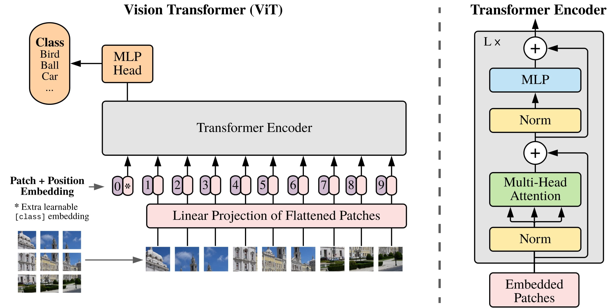

# DS5690_project

## Overview

The project is an innovative application designed to enhance the accuracy and efficiency of Nike shoe classification using advanced machine learning techniques. This project leverages the Vision Transformer (ViT), a model that has demonstrated superior performance in image recognition tasks, to address the challenges faced by traditional shoe classification systems.

### Motivation 
Have you ever been curious about your friends new shoes, or attracted by fancy shoes shows on ins photos? Time to try Nike shoes Recognizer! Traditional shoe classification systems struggle to differentiate among detailed and similar categories of Nike shoes. This project aims to improve classification precision by utilizing a Vision Transformer (ViT) model known for its effectiveness in handling complex image data.

In the past, the main approach to solve these tasks is Convolutional Neural Networks(CNNs). However, CNNs usually struggling when using on shoes recognization since shoes from the same brand usually have similar shape structure. And CNN perform weakly in extracting effective features for differentiation. Thus, it is usually not precise enough to classify shoes.

That's reason using the Vision Transformer (ViT) model, which is more suitable for handling long-distance dependencies and extracting global features through self-attention mechanisms.

### Vit Introduction
The Vision Transformer (ViT) model was proposed in An Image is Worth 16x16 Words: Transformers for Image Recognition at Scale. While the Transformer architecture has become the de-facto standard for natural language processing tasks, its applications to computer vision remain limited. In vision, attention is either applied in conjunction with convolutional networks, or used to replace certain components of convolutional networks while keeping their overall structure in place. 

Researchers show that this reliance on CNNs is not necessary and a pure transformer applied directly to sequences of image patches can perform very well on image classification tasks. When pre-trained on large amounts of data and transferred to multiple mid-sized or small image recognition benchmarks (ImageNet, CIFAR-100, VTAB, etc.), Vision Transformer (ViT) attains excellent results compared to state-of-the-art convolutional networks while requiring substantially fewer computational resources to train.

The Vision Transformer (ViT) is a transformer encoder model (BERT-like) pretrained on a large collection of images in a supervised fashion, namely ImageNet-21k, at a resolution of 224x224 pixels. Next, the model was fine-tuned on ImageNet (also referred to as ILSVRC2012), a dataset comprising 1 million images and 1,000 classes, also at resolution 224x224.

Images are presented to the model as a sequence of fixed-size patches (resolution 16x16), which are linearly embedded. One also adds a [CLS] token to the beginning of a sequence to use it for classification tasks. One also adds absolute position embeddings before feeding the sequence to the layers of the Transformer encoder.

By pre-training the model, it learns an inner representation of images that can then be used to extract features useful for downstream tasks: if you have a dataset of labeled images for instance, you can train a standard classifier by placing a linear layer on top of the pre-trained encoder. One typically places a linear layer on top of the [CLS] token, as the last hidden state of this token can be seen as a representation of an entire image.

## Model Introductin
We employ a Vision Transformer architecture, originally designed for tasks where long-distance relationships in data are critical. This model is adapted to classify Nike shoes by recognizing subtle differences between models and variants.

### Vision Transformer Model Details

Model Name: Nike Shoe Type Image Classification Vision Transformer

Base Model: Adapted from a model pre-trained on general image datasets.

Fine-Tuning: The model is fine-tuned on a specific dataset comprising various types of Nike shoes to capture distinctive features relevant to Nike's product line.

Performance: The model aims to achieve high accuracy, ensuring reliable classification across different shoe types.

### Dataset
Name: Nike Shoe Image Classification Dataset

Size: Features thousands of labeled images of various Nike shoes.

Description: The dataset includes diverse Nike shoe types to cover a wide range of models and styles.

### Chatbot Integration with OpenAI
Function: The chatbot, powered by OpenAI's GPT-3.5, assists users by providing price ranges and additional information on the classified Nike shoe types.

Interaction: Users can interact with the chatbot through a user-friendly interface after the image classification to inquire about prices or other details.

## Demo

## Future Steps
1. Expand Dataset: Include newer models and limited editions to keep the classifier up-to-date.
2. Enhance Chatbot Capabilities: Improve the chatbot's responses and integrate real-time market data for more accurate price information.
3. Multimodal Approaches: Explore combining text and image data to enhance the accuracy and richness of the classification and user interaction.

## Critical Thinking

### Choice of Model Architecture
The decision to employ the Vision Transformer (ViT) over traditional Convolutional Neural Networks (CNNs) for this project stems from critical evaluation of both models' strengths and weaknesses in image classification tasks. CNNs, while robust for many visual recognition tasks, often falter when tasked with recognizing fine-grained distinctions within highly similar categories, such as different models of Nike shoes. These models have inherent limitations in capturing global context, which is crucial when differentiating products with subtle variations.

Vision Transformers, on the other hand, leverage self-attention mechanisms that inherently consider the entire image, allowing for a more nuanced understanding of global features. This capability is particularly beneficial for distinguishing between similar shoe models where contextual and textural details are pivotal. By critically analyzing the specific requirements of our classification task—recognizing subtle differences between Nike shoe models—ViT emerged as a more fitting choice due to its superior handling of complex patterns and long-range dependencies in image data.

## Resource
1. google/vit-base-patch16-224 https://huggingface.co/google/vit-base-patch16-224
2. Nike shoes dataset https://www.kaggle.com/datasets/francisco1010/nike-shoe-classifications
3. An Image is Worth 16x16 Words: Transformers for Image Recognition at Scale https://arxiv.org/abs/2010.11929
4. gradio https://www.gradio.app/guides/quickstart
